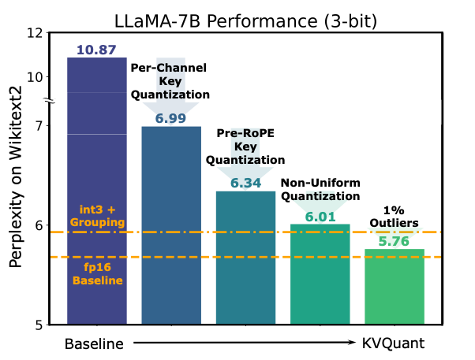

# KVQuant: Towards 10 Million Context Length LLM Inference with KV Cache Quantization [[Paper](https://arxiv.org/abs/2401.18079)]



KVQuant is a methodology for efficient KV cache quantization that incorporates several innovations to acheive accurate low-precision quantization, thereby enabling efficient long context length inference.

TLDR: KVQuant addresses the memory bottleneck with long context length inference by quantizing the KV cache to low precision. KVQuant achieves high accuracy with low-precision KV cache quantization by considering several consistent patterns observed in cached KV values across different LLMs, and by developing methods to exploit these patterns, including:
- **Per-channel, Pre-RoPE** Key quantization to better match the outlier channels in Keys
- Non-Uniform Quantization (**NUQ**) to better represent the non-uniform activations
- **Dense-and-Sparse Quantization** to mitigate the impacts of numerical outliers on quantization difficulty
- **Q-Norm** to mitigate distribution shift at ultra low precisions (eg. 2-bit)

KVQuant enables serving the **LLaMA-7B model with 1M context length on a single A100-80GB GPU**, or even the **LLaMA-7B model with 10M context length on an 8-GPU system** 🔥

[[TLDR: Twitter Thread](https://twitter.com/coleman_hooper1/status/1754217130550329613)]
[[Paper](https://arxiv.org/abs/2401.18079)]

---
## Installation

The codebase contains three different subfolders, each of which has its own README file with instructions that you can follow for installing the required environment for that step.

---

### How the code is structured

- `gradients` - codebase for computing fisher information - this is required to be able to quantize a new model
- `quant` - codebase for running simulated quantization + eval experiments (need to first compute fisher information)
- `deployment` - codebase for running efficient inference with compressed vectors (need to first get quantizers from quant step)

To reproduce the perplexity numbers reported in the paper, run `gradients` and then `quant`.

---

### Roadmap:
- ~~add deployment code~~
- multi-GPU evaluation environment for long sequence length evaluation with simulated quantization
- unify environments to simplify installation
- optimized kernels for A100
- additional evaluation on long context lengths + different downstream tasks
- multi-GPU inference

---

## Acknowledgement

This code reuses components from several libraries including [GPTQ](https://github.com/IST-DASLab/gptq), [GPTQ-For-LLaMA](https://github.com/qwopqwop200/GPTQ-for-LLaMa/), and [SqueezeLLM](https://github.com/SqueezeAILab/SqueezeLLM/).

---

## Citation

KVQuant has been developed as part of the following paper. We appreciate it if you would please cite the following paper if you found the library useful for your work:

```
@article{hooper2024kvquant,
  title={KVQuant: Towards 10 Million Context Length LLM Inference with KV Cache Quantization},
  author={Hooper, Coleman and Kim, Sehoon and Mohammadzadeh, Hiva and Mahoney, Michael W and Shao, Yakun Sophia and Keutzer, Kurt and Gholami, Amir},
  journal={arXiv preprint arXiv:2401.18079},
  year={2024}
}
```
