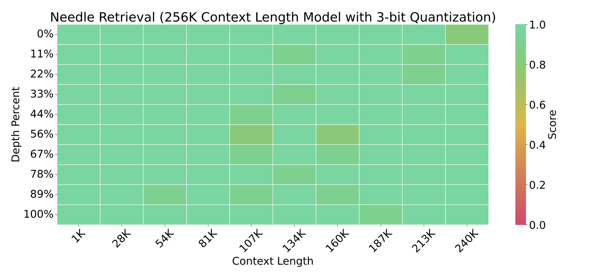

# Long Context Length Inference Using Large World Model with KVQuant

[Large World Model (LWM)](https://github.com/LargeWorldModel/LWM) is a recent work that enables training long context length models with up to 1M context length. However, inference with these long context length models is expensive, particularly due to the large KV cache size required to support inference with these models. Generating 1M tokens with the KV cache stored in fp16 would require 490 GB for the KV cache alone. 

Our work, KVQuant, enables efficient and accurate long context inference using a quantized KV cache. By leveraging our 3-bit quantization method with outlier support, we can reduce the KV cache size by 4.8x, enabling 512K context length on a single A100 GPU. Additionally, using our 2-bit method, we can enable 1M context length generation on a single A100. We replicated the haystack evaluation results from LWM with our 3-bit quantization method using the 256K context length model, demonstrating that KVQuant retains the performance of the base model even when evaluated using long context lengths.



_Haystack evaluation (input length=256k) using the 3-bit quantization scheme from KVQuant, averaged over 10 samples. KVQuant retains the retrieval performance of the base model, even when evaluated using long context lengths._ 

| Model |  fp16 | nuq4-1% | nuq3-1% |  nuq2-1% |
| -------- | -------- | -------- | -------- | -------- |
| LWM-Text-Chat-128K    |  9.63 | 9.67| 9.94 | 11.57 | 
| LWM-Text-Chat-256K    |  7.98 | 8.03 | 8.23 | 9.38 | 
| LWM-Text-Chat-512K    |  8.48 |  8.54 | 8.80 | 10.38 | 
| LWM-Text-Chat-1M    |  8.90 |  8.98 | 9.22 | 10.80 | 

_Perplexity evaluation (2K sequence length) using LWM models, evaluated with and without KVQuant. These results are using 1% outliers (capped at 1% outliers per token for keys), and each of these results leverages the attention sink quantization method with the first 5 tokens left in fp16._

## Downloading Quantized Checkpoints

The base LWM checkpoints can be downloaded from the [LWM repo](https://github.com/LargeWorldModel/LWM).

Quantization centroids and outlier thresholds can be downloaded for each of the LWM-text models from Huggingface. These can then be used along with the base model to run inference with the quantized model. Each of these checkpoints uses 1% outliers (capping at 1% outliers per token for keys), and each of them uses the attention sink method with the first 5 tokens left in fp16.

| Model |  nuq4-1% | nuq3-1% |  nuq2-1% |
| -------- | -------- | ------ | ------ |
| LWM-Text-Chat-128K    |  [lwm-7b-a4-s1](https://huggingface.co/squeeze-ai-lab/lwm-text-chat-128K-a4-s1) | [lwm-7b-a3-s1](https://huggingface.co/squeeze-ai-lab/lwm-text-chat-128K-a3-s1) |  [lwm-7b-a2-s1](https://huggingface.co/squeeze-ai-lab/lwm-text-chat-128K-a2-s1) | 
| LWM-Text-Chat-256K    |  [lwm-7b-a4-s1](https://huggingface.co/squeeze-ai-lab/lwm-text-chat-256K-a4-s1) | [lwm-7b-a3-s1](https://huggingface.co/squeeze-ai-lab/lwm-text-chat-256K-a3-s1) |  [lwm-7b-a2-s1](https://huggingface.co/squeeze-ai-lab/lwm-text-chat-256K-a2-s1) | 
| LWM-Text-Chat-512K    |  [lwm-7b-a4-s1](https://huggingface.co/squeeze-ai-lab/lwm-text-chat-512K-a4-s1) | [lwm-7b-a3-s1](https://huggingface.co/squeeze-ai-lab/lwm-text-chat-512K-a3-s1) |  [lwm-7b-a2-s1](https://huggingface.co/squeeze-ai-lab/lwm-text-chat-512K-a2-s1) | 
| LWM-Text-Chat-1M    |  [lwm-7b-a4-s1](https://huggingface.co/squeeze-ai-lab/lwm-text-chat-1M-a4-s1) | [lwm-7b-a3-s1](https://huggingface.co/squeeze-ai-lab/lwm-text-chat-1M-a3-s1) |  [lwm-7b-a2-s1](https://huggingface.co/squeeze-ai-lab/lwm-text-chat-1M-a2-s1) | 


## Installation

1. First follow the installation instructions in the deployment directory and activate the “deploy” conda environment.
```
...
conda activate deploy
```

2. Install additional dependencies for LWM
```
pip install einops tqdm tiktoken scikit-learn langchain python-dotenv
```

3. Run inference with a sample prompt. “maxseqlen” should be set to be large enough to fit the entire KV cache for the sequence. 

```
CUDA_VISIBLE_DEVICES=0 python llama_inference.py <path-to-base-model>  --abits 4 --quantizer-path <path-to-downloaded-quantizer> --include_sparse --sparsity-threshold 0.99 --text <input prompt here> --maxseqlen 2048  --first_few_fp16 5
```

4. Run haystack evaluation (matching the 256K eval from the paper)

```
CUDA_VISIBLE_DEVICES=0 python eval_haystack_pytorch_quant.py --path_to_ckp <path-to-base-model> --abits 4 --quantizer-path <path-to-downloaded-quantizer> --include_sparse --sparsity-threshold 0.99  --first_few_fp16 5 --maxseqlen 241000
```

